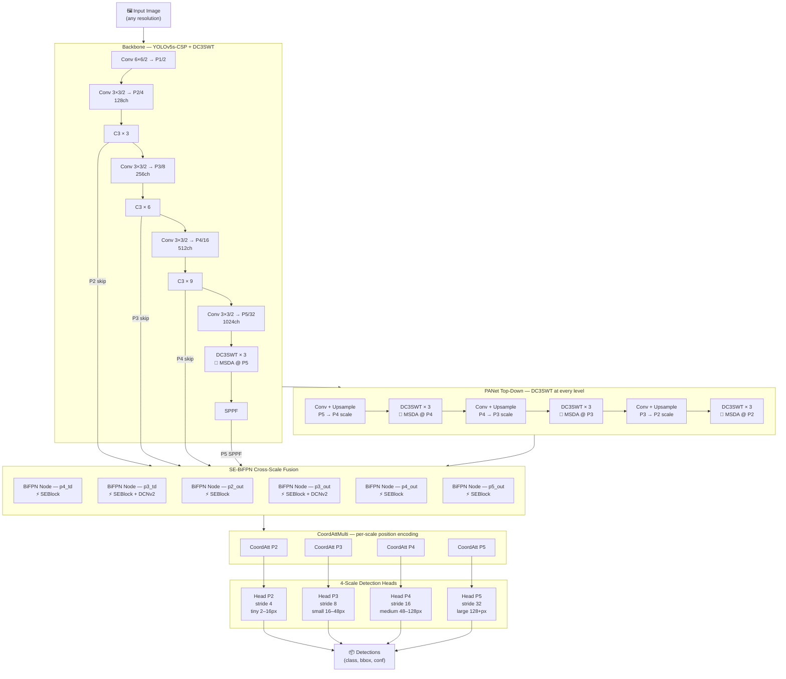
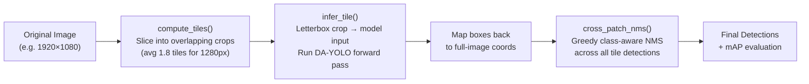

<div align="center">
  <h1>DA-YOLO: Deformable Attention YOLO</h1>
  <p>
    A novel object detection architecture built on YOLOv5, combining<br>
    <strong>Multi-Scale Deformable Attention (DC3SWT)</strong>
    · <strong>WIoU Geometric Loss</strong>
    · <strong>SE-BiFPN Neck</strong>
    · <strong>Coordinate Attention</strong>
    · <strong>4-Scale Detection (P2–P5)</strong><br>
    Optimised for dense, high-resolution imagery and small-object detection.
  </p>
</div>

---

## Overview

**DA-YOLO** (Deformable Attention YOLO) is a small-object detection framework that extends YOLOv5s with five principled architectural improvements, each motivated by the challenges of drone-captured and remote-sensing imagery:

| # | Component | Where | What it solves |
|---|---|---|---|
| 1 | **DC3SWT** | Backbone P5 + PANet neck (P2–P4) | Fixed-window attention breaks on arbitrary object locations |
| 2 | **WIoU v1** | Box regression loss | CIoU gives equal weight to easy and hard anchors |
| 3 | **SE-BiFPN** | All 6 BiFPN fusion nodes | Channel redundancy after multi-path feature fusion |
| 4 | **CoordAttMulti** | Detection head input | Spatial position lost in channel-only attention |
| 5 | **4-Scale Head (P2–P5)** | Detection output | 3-scale head misses sub-8-pixel objects |

Inspired by *"Swin-Transformer-Based YOLOv5 for Small-Object Detection in Remote Sensing Images"* (Sensors 2023, 23, 3634), extended by replacing fixed-window Swin attention with **Multi-Scale Deformable Attention** (MSDA, arxiv:2010.04159).

---

## Benchmarks

### VisDrone2019-DET Validation Set (548 images, 10 classes)

| Model | Params | GFLOPs | mAP@0.5 | mAP@0.5:0.95 | Precision | Recall | FPS |
|---|---|---|---|---|---|---|---|
| DA-YOLO v1 (epoch 131) | 5.54M | 35.52 | 25.64% | 13.96% | 0.380 | 0.310 | 36.8 |
| DA-YOLO v2 (epoch 195) | 5.54M | 35.52 | 28.53% | 15.78% | 0.345 | 0.325 | 36.8 |
| **DA-YOLO v2 + SAHI** | 5.54M | 35.52 | **30.85%** | **16.77%** | 0.632 | 0.279 | ~9.1 |

> v2 trained 200 epochs from scratch with `copy_paste=0.5`, `anchor_t=3.5`, `iou_t=0.18`.  
> SAHI: 1280px tiles, 25% overlap, avg 1.8 tiles/image, cross-patch NMS.

### VisDrone Per-Class AP@0.5 — v2 + SAHI (best)

| Class | AP@0.5 | AP@0.5:0.95 | Δ vs v1 |
|---|---|---|---|
| pedestrian | 52.84% | 23.31% | +6.24pp |
| people | 36.42% | 12.53% | +5.12pp |
| bicycle | 1.07% | 0.31% | −2.51pp |
| **car** | **80.43%** | 52.54% | +1.63pp |
| van | 16.99% | 11.98% | +6.53pp |
| truck | 14.92% | 8.28% | +0.47pp |
| tricycle | 9.70% | 5.13% | +2.98pp |
| **awning-tricycle** | **17.06%** | 11.94% | **+13.94pp** (was 0%) |
| bus | 31.52% | 22.56% | +6.05pp |
| motor | 47.49% | 19.16% | +8.09pp |

> Key win: `awning-tricycle` went from **0% → 17.06%** — solved by `copy_paste=0.5` augmentation synthesising rare-class instances.

---

### DIOR-R Validation Set (5863 images, 20 classes, 800×800)

| Model | Params | GFLOPs | mAP@0.5 | mAP@0.5:0.95 | Precision | Recall | FPS |
|---|---|---|---|---|---|---|---|
| **DA-YOLO (epoch 144)** | **5.55M** | **14.08** | **60.00%** | **37.00%** | **0.666** | **0.583** | **62.6** |

> 200 epochs from scratch · 800px · batch 8 · `hyp.dior.yaml` · `models/da_yolo_dior.yaml`  
> Eval: `eval_results/dior_v1/`  — GFLOPs at 800px; same weights give 35.52 GFLOPs at 1280px.

### DIOR-R Per-Class AP@0.5 (20 classes)

| Class | AP@0.5 | AP@0.5:0.95 | | Class | AP@0.5 | AP@0.5:0.95 |
|---|---|---|---|---|---|---|
| **airplane** | **91.17%** | 65.16% | | golffield | 39.76% | 13.12% |
| **baseballfield** | **91.92%** | 76.14% | | groundtrackfield | 51.39% | 34.66% |
| **ship** | **90.18%** | 50.08% | | harbor | 36.35% | 16.23% |
| **tenniscourt** | **88.85%** | 75.77% | | overpass | 39.94% | 19.12% |
| **chimney** | **86.75%** | 63.11% | | expressway-service | 51.99% | 24.04% |
| stadium | 80.54% | 44.41% | | expressway-toll | 55.59% | 36.62% |
| storagetank | 78.74% | 59.72% | | vehicle | 68.26% | 39.84% |
| basketballcourt | 75.62% | 55.54% | | windmill | 72.42% | 30.15% |
| bridge | 29.52% | 12.62% | | airport | 28.72% | 10.10% |
| dam | 25.11% | 8.44% | | **trainstation** | **17.18%** | 5.22% |

> Strong: geometric/regular structures (fields, courts, tanks). Weak: complex/variable structures (train stations, dams, bridges).

---

## Novel Contributions

### 1. DC3SWT — Deformable C3 Swin Transformer Block

> `models/dc3swt.py` · `DC3SWT` and `MSDABlock` classes

The standard Swin Transformer partitions feature maps into fixed 8×8 windows and computes attention only within each window. This fails in remote-sensing imagery because:

- Small objects rarely align with pre-defined window boundaries
- Dense clusters span multiple windows simultaneously
- Objects appear at arbitrary locations and scales

**DC3SWT** replaces the W-MSA + SW-MSA mechanism with **Multi-Scale Deformable Attention (MSDA)**. For each query location the network *learns where to look* by predicting M×K sampling offsets:

```
For each query position q at (x_q, y_q):
  1. Reference point  p_q  = (x_q/W, y_q/H)            ← normalised [0,1] grid
  2. Predict offsets  Δp_{mk} ∈ (−0.5, 0.5)            ← tanh-clamped linear projection
  3. Sample values    v at (p_q + Δp_{mk})              ← F.grid_sample (bilinear)
  4. Attend          out = Σ_m Σ_k A_{mk} · v_{mk}     ← softmax attention weights
  5. Project          output = W_o · out
```

**Pure PyTorch — no custom CUDA extensions** (`F.grid_sample` handles bilinear sampling).

| Property | C3SWT (baseline) | DC3SWT (proposed) |
|---|---|---|
| Attention type | W-MSA + SW-MSA (fixed windows) | MSDA (learned offsets) |
| Window boundary handling | Split → shifted windows | Implicit via offset prediction |
| Non-square inputs | Requires padding to window multiple | Native — no padding needed |
| Small feature maps | Clamp window to min(H,W) | Clamp n_points to H×W |
| Custom CUDA | No | No |
| Parameters (YOLOv5s) | ~6.39M | ~5.64M (−11%) |

DC3SWT is placed at **backbone P5** and at **all three PANet levels (P4, P3, P2)**, giving the network deformable attention throughout the feature hierarchy.

---

### 2. WIoU v1 — Weighted IoU Geometric Loss

> `utils/metrics.py` · `bbox_iou(WIoU=True)` · activated via `loss_type: wiou` in any hyp yaml

Standard CIoU treats all regression targets equally regardless of geometric difficulty. WIoU v1 (AAAI 2023) introduces a **geometric focusing factor** that down-weights easy, well-aligned anchors and concentrates gradient on geometrically hard predictions:

```
g   = exp(ρ² / c²)          where ρ = centre distance, c = enclosing diagonal
WIoU_loss = g × (1 − IoU)
```

When ρ ≈ 0 (well-centred), g ≈ 1 and loss equals standard IoU loss.
When ρ is large (poor centring), g > 1 — forcing correction of geometrically poor predictions.

This is particularly effective on VisDrone where the anchor set spans a 75× range (4px–300px) and many anchors have large positional mismatches.

**Integration:** `bbox_iou()` returns `1 − g*(1−iou)`, so the existing `lbox += (1−iou).mean()` call site in `loss.py` works unchanged.

---

### 3. SE Channel Attention in BiFPN

> `models/bifpn.py` · `SEBlock` class · `BiFPNLayer(use_se=True)`

After BiFPN weighted fusion, different channels carry features from paths with very different spatial histories. **SEBlock** applies lightweight channel recalibration after every fusion convolution:

```
scale = Sigmoid( Linear(SiLU(Linear(AvgPool2d(x)))) )
output = x × scale
```

Placed at **all 6 BiFPN fusion nodes** (p4_td, p3_td, p2_out, p3_out, p4_out, p5_out). Total cost: ~49K parameters at C=256 (<1% of model). Set `use_se=False` to use `nn.Identity` passthrough at zero cost.

---

### 4. CoordAttMulti — Coordinate Attention

> `models/coord_attention.py` · `CoordAttMulti` class

Standard channel attention (SE) pools spatial information entirely, losing positional context. **Coordinate Attention** decomposes spatial pooling into H-axis and W-axis directional pooling, preserving position information:

```
x_h = AvgPool(x, kernel=(1,W))  → (B,C,H,1)
x_w = AvgPool(x, kernel=(H,1))  → (B,C,1,W)
```

`CoordAttMulti` applies one CA layer per detection scale (P2, P3, P4, P5), injecting position information immediately before the detection head. **Orthogonal to SE** — SE recalibrates channels after fusion; CoordAtt encodes spatial position before detection.

---

### 5. 4-Scale Detection Head (P2–P5)

Standard YOLOv5 uses 3 scales (P3/P4/P5, strides 8/16/32). Minimum detectable object at stride 8 is ~8×8px. On VisDrone objects can be 2–4px.

| Head | Stride | Object range | Dataset example |
|---|---|---|---|
| P2 | 4 | 2–16 px | Pedestrians/bicycles at distance (VisDrone) |
| P3 | 8 | 16–48 px | Small vehicles, people |
| P4 | 16 | 48–128 px | Vehicles, buses |
| P5 | 32 | 128+ px | Large vehicles, airport runways (DIOR-R) |

DCNv2 is placed **exclusively at the P3 BiFPN output** — the only node receiving three distinct spatial paths simultaneously (backbone skip, top-down from P4/P5, bottom-up from P2), giving the highest alignment benefit-to-cost ratio.

---

## Mathematical Formulations

This section provides the complete mathematical definitions for all trainable components in DA-YOLO, intended as a paper-writing reference.

---

### 1. Multi-Scale Deformable Attention (MSDA) — DC3SWT

Given input feature map $\mathbf{x} \in \mathbb{R}^{C \times H \times W}$, query $q$ at spatial location $(x_q, y_q)$, and normalized reference point $\mathbf{p}_q = (x_q/W,\; y_q/H) \in [0,1]^2$:

$$\text{MSDA}(q,\,\mathbf{p}_q,\,\mathbf{x}) = \sum_{m=1}^{M} W_m \left[\sum_{k=1}^{K} A_{mqk} \cdot \phi\!\left(\mathbf{x}_m,\;\mathbf{p}_q + \Delta\mathbf{p}_{mqk}\right)\right]$$

| Symbol | Definition |
|---|---|
| $M$ | Number of attention heads ($M=8$ in DC3SWT) |
| $K$ | Sampling points per head ($K=4$) |
| $\Delta\mathbf{p}_{mqk} \in (-0.5,\,0.5)^2$ | Learned 2D offset — predicted by a linear layer then tanh-clamped |
| $A_{mqk}$ | Attention weight; $\sum_{k=1}^{K} A_{mqk} = 1$ (softmax across $K$) |
| $\phi(\mathbf{x}_m, \cdot)$ | Bilinear sampling — implemented as `F.grid_sample` (no custom CUDA) |
| $W_m \in \mathbb{R}^{C_v \times C_v}$ | Per-head output projection matrix |

Offsets $\Delta\mathbf{p}$ and attention weights $A$ are predicted jointly from the query features:

$$\left[\Delta\mathbf{p}_{m1},\ldots,\Delta\mathbf{p}_{mK},\; A_{m1},\ldots,A_{mK}\right] = \text{Linear}_{3MK}(q)$$

The $3MK$ projection outputs $2MK$ offset coordinates and $MK$ raw attention logits (softmax-normalized per head). This is the key distinction from fixed Swin windows: sampling locations are data-dependent, not grid-aligned.

---

### 2. WIoU v1 — Geometric Focusing Loss

**Geometric focusing factor:**

$$g = \exp\!\left(\frac{\rho^2}{c^2}\right)$$

where $\rho = \|\mathbf{c}_{\text{pred}} - \mathbf{c}_{\text{gt}}\|_2$ is the Euclidean distance between predicted and ground-truth box centres, and $c$ is the diagonal length of the smallest enclosing box.

**WIoU regression loss:**

$$\mathcal{L}_{\text{WIoU}} = g \cdot (1 - \text{IoU})$$

**Behaviour:**

| Anchor quality | $\rho$ | $g$ | Effect |
|---|---|---|---|
| Well-centred (easy) | $\rho \approx 0$ | $g \approx 1$ | Reduces to standard IoU loss |
| Poorly-centred (hard) | $\rho \gg 0$ | $g \gg 1$ | Amplifies gradient — forces correction |

Integration: `bbox_iou(WIoU=True)` returns $-(g \cdot \text{IoU} - g + 1)$ so the standard `lbox += (1 - iou).mean()` call site works unchanged. Activated via `loss_type: wiou` in any hyp yaml.

---

### 3. SE-BiFPN — BiFPN Weighted Fusion + SE Channel Recalibration

**BiFPN fast normalized weighted fusion:**

$$\mathbf{O} = \text{Conv}\!\left(\sum_{i=1}^{N} \frac{w_i}{\varepsilon + \sum_{j=1}^{N} w_j} \cdot \mathbf{I}_i\right), \quad w_i = \text{ReLU}(\hat{w}_i)$$

where $\hat{w}_i$ are learnable scalars initialized to 1 and $\varepsilon = 10^{-4}$ ensures numerical stability. The three-input P3_out fusion (the only node receiving backbone skip + top-down + bottom-up paths simultaneously) is:

$$P_3^{\text{out}} = \text{DConv}\!\left(\frac{w_1 P_3 + w_2 P_3^{\text{td}} + w_3\,\text{Up}(P_2^{\text{out}})}{w_1 + w_2 + w_3 + \varepsilon}\right)$$

where $\text{DConv}$ denotes Deformable Conv v2 (DCNv2) — placed exclusively at P3 because this node has the highest spatial misalignment from three distinct receptive-field paths.

**SE channel recalibration** — applied after every BiFPN fusion convolution at all 6 nodes:

Squeeze (global average pooling):
$$\mathbf{z}_c = \frac{1}{H \times W} \sum_{i=1}^{H} \sum_{j=1}^{W} x_{c,i,j}$$

Excitation (bottleneck MLP):
$$\mathbf{s} = \sigma\!\left(W_2\, \delta\!\left(W_1 \mathbf{z}\right)\right), \quad W_1 \in \mathbb{R}^{C/r \times C},\; W_2 \in \mathbb{R}^{C \times C/r}$$

where $\delta$ is SiLU activation, $\sigma$ is sigmoid, and $r = 16$ (reduction ratio).

Recalibration:
$$\hat{\mathbf{x}}_{c,i,j} = x_{c,i,j} \cdot s_c$$

Cost: $2C^2/r$ parameters per SE block — ≈49K at $C=256$ (<1% of total model parameters).

---

### 4. CoordAttMulti — Coordinate Attention

Standard channel attention (SE) collapses both spatial dimensions — losing position information. CoordAtt decomposes spatial pooling into two 1D operations along H and W axes separately.

**Directional pooling:**

$$z^h_c(i) = \frac{1}{W}\sum_{j=1}^{W} x_c(i,j) \in \mathbb{R}^{H}, \qquad z^w_c(j) = \frac{1}{H}\sum_{i=1}^{H} x_c(i,j) \in \mathbb{R}^{W}$$

**Joint encoding** (concatenate along spatial axis, encode with shared Conv):

$$\mathbf{f} = \delta\!\left(\text{BN}\!\left(W_1 \cdot \text{concat}\!\left[\mathbf{z}^h,\; (\mathbf{z}^w)^\top\right]\right)\right) \in \mathbb{R}^{C' \times (H+W)}$$

**Split and gate:**

$$\mathbf{f}^h,\; \mathbf{f}^w = \text{split}(\mathbf{f},\;\text{dim}=H)$$

$$\mathbf{g}^h = \sigma(W_h\, \mathbf{f}^h) \in \mathbb{R}^{C \times H}, \qquad \mathbf{g}^w = \sigma(W_w\, \mathbf{f}^w) \in \mathbb{R}^{C \times W}$$

**Output** (element-wise modulation preserving 2D position):

$$\hat{x}_{c,i,j} = x_{c,i,j} \cdot g^h_c(i) \cdot g^w_c(j)$$

`CoordAttMulti` instantiates one CA layer per detection scale (P2, P3, P4, P5) — injecting positional gates immediately before each detection head.

---

### 5. CIOU K-means Anchor Clustering

Standard IoU-based k-means (YOLOv5) uses $d = 1 - \text{IoU}$ as the clustering distance. DA-YOLO uses **CIoU distance** to account for both box overlap and aspect ratio:

$$d(\mathbf{a},\,\mathbf{b}) = 1 - \text{CIoU}(\mathbf{a},\,\mathbf{b})$$

$$\text{CIoU}(\mathbf{a},\,\mathbf{b}) = \text{IoU} - \frac{\rho^2}{c^2} - \alpha\, v$$

where:
- $\rho = \|\mathbf{c}_a - \mathbf{c}_b\|_2$: centre distance; $c$: enclosing diagonal  
- $v = \frac{4}{\pi^2}\!\left(\arctan\frac{w^{\text{gt}}}{h^{\text{gt}}} - \arctan\frac{w}{h}\right)^{\!2}$: aspect-ratio consistency term  
- $\alpha = \frac{v}{(1-\text{IoU})+v}$: trade-off coefficient

**Cluster assignment:**

$$k^*(b) = \arg\min_{k \in \{1,\ldots,K\}} d(\mathbf{a}_k,\,\mathbf{b})$$

CIoU distance is specifically shape-aware — anchors clustered with it yield better Best Possible Recall (BPR) than IoU-only clustering for elongated objects (vehicles, runways, bridges).

---

### 6. Total Training Loss

$$\mathcal{L} = \lambda_{\text{box}}\,\mathcal{L}_{\text{box}} + \lambda_{\text{obj}}\,\mathcal{L}_{\text{obj}} + \lambda_{\text{cls}}\,\mathcal{L}_{\text{cls}}$$

| Term | Formula | Default weight |
|---|---|---|
| $\mathcal{L}_{\text{box}}$ | $\mathcal{L}_{\text{WIoU}} = g \cdot (1 - \text{IoU})$ | $\lambda_{\text{box}} = 0.05$ |
| $\mathcal{L}_{\text{obj}}$ | $\text{BCE}(\hat{p}_{\text{obj}},\, t_{\text{obj}})$ with focal scaling | $\lambda_{\text{obj}} = 1.0$ |
| $\mathcal{L}_{\text{cls}}$ | $\text{BCE}(\hat{p}_{\text{cls}},\, t_{\text{cls}})$ per class | $\lambda_{\text{cls}} = 0.5$ |

Objectness target $t_{\text{obj}} = \text{IoU}(\text{pred}, \text{gt})$ (soft label — standard YOLOv5). All heads (P2–P5) contribute to $\mathcal{L}$; P2 uses the smallest anchors, so its objectness gradient is most sensitive to the `obj` weight in `hyp.yaml`.

---

## Architecture Diagram



**Legend:**
- 🔵 **DC3SWT**: Multi-Scale Deformable Attention (MSDA) — replaces fixed Swin windows
- ⚡ **SEBlock**: Squeeze-Excitation channel recalibration at each BiFPN fusion node
- **DCNv2**: Deformable Conv at P3 BiFPN node (highest spatial misalignment junction)
- **CoordAtt**: H/W-directional pooling — preserves spatial position before detection

---

## Installation

```bash
git clone <this-repo>
cd DA-YOLO

python3 -m venv venv
source venv/bin/activate          # Windows: venv\Scripts\activate

pip install -r requirements.txt
# Key packages: torch>=1.12, torchvision>=0.13, timm>=0.9.0

# Verify all components
venv/bin/python3 tests/test_components.py
# Expected: 36/36 passed — All tests passed! ✅
```

---

## Dataset Setup

### VisDrone2019-DET

10-class drone-captured dataset. 6,471 train / 548 val / 1,610 test images at 1920×1080.

**Download**

```bash
pip install gdown
mkdir -p /data/VisDrone && cd /data/VisDrone

gdown --fuzzy "https://drive.google.com/file/d/1a2oHjcEcwXP8oUF9gaL7xyqMYwkigTe0" -O VisDrone2019-DET-train.zip
gdown --fuzzy "https://drive.google.com/file/d/1bxK5zgLn0_L8x276eKkuYA_FzwCIjb59" -O VisDrone2019-DET-val.zip

unzip VisDrone2019-DET-train.zip && unzip VisDrone2019-DET-val.zip
```

**Convert → YOLO format**

```bash
venv/bin/python3 utils/visdrone_converter.py \
    --root /data/VisDrone \
    --out  /data/VisDrone/yolo
# → 6471 train images, 548 val images, 10 classes
```

**Re-cluster anchors**

```bash
venv/bin/python3 utils/ciou_kmeans.py \
    --label-dir /data/VisDrone/yolo/labels/train \
    --img-size 1280 --n-clusters 12
# Paste output into models/da_yolo.yaml anchors section
```

**Update dataset yaml** (`data/visdrone.yaml`):
```yaml
path: /data/VisDrone/yolo
```

---

### DIOR-R

20-class remote sensing dataset. 11,725 images at fixed 800×800px — no tiling required.  
Publicly available on Google Drive: https://gcheng-nwpu.github.io/#Datasets

**Download**

```bash
pip install gdown

# Download all four zips from the DIOR-R dataset page, then:
unzip Annotations.zip    -d /data/DIOR-R/
unzip ImageSets.zip      -d /data/DIOR-R/ImageSets/
unzip JPEGImages-trainval.zip -d /data/DIOR-R/
```

Expected structure after extraction:
```
/data/DIOR-R/
  Annotations/
    Horizontal Bounding Boxes/   *.xml   ← 20,000 annotation files
    Oriented Bounding Boxes/     *.xml   (OBB — not used currently)
  ImageSets/
    Main/  train.txt  val.txt  test.txt
  JPEGImages-trainval/  *.jpg   (11,725 images)
```

**Convert → YOLO format**

The converter auto-detects the `Horizontal Bounding Boxes` subdirectory:

```bash
venv/bin/python3 utils/dior_converter.py \
    --root /data/DIOR-R \
    --out  /data/DIOR-R/yolo \
    --splits train val
# → 5862 train + 5863 val images / 68,070 boxes / 20 classes
```

**Re-cluster anchors for 800px**

```bash
venv/bin/python3 utils/ciou_kmeans.py \
    --label-dir /data/DIOR-R/yolo/labels/train \
    --img-size 800 --n-clusters 12
# Paste output into models/da_yolo_dior.yaml
```

**Train**

```bash
venv/bin/python3 train_da_yolo.py \
    --data data/dior.yaml \
    --cfg  models/da_yolo_dior.yaml \
    --hyp  data/hyps/hyp.dior.yaml \
    --mode scratch \
    --img-size 800 \
    --batch-size 8 \
    --name dior_scratch
```

---

### DOTA 1.5 (pre-tiled)

16-class aerial dataset. Pre-tiled 1024×1024px patches — no tiling step needed.  
Source: https://captain-whu.github.io/DOTA/dataset.html

The provided zips contain already-tiled images paired with OBB labels (8-coordinate polygon format). `dota_hbb_converter.py` converts OBB → axis-aligned HBB directly from zip — no intermediate extraction needed.

```
DOTA_dataset/
  lebel/train/train.zip       ← 10,595 images + OBB labels (mixed in one zip)
  lebel/val/val_label.zip     ← 3,360 images + OBB labels
  test/test.zip               ← images only (no labels)
  val/val.zip                 ← images only (duplicate of val_label.zip images)
```

**Convert OBB → YOLO HBB** (processes zip directly, saves ~17GB of temp disk space)

```bash
venv/bin/python3 utils/dota_hbb_converter.py \
    --train-zip DOTA_dataset/lebel/train/train.zip \
    --val-zip   DOTA_dataset/lebel/val/val_label.zip \
    --out       /data/DOTA/yolo
# → 10,595 train + 3,360 val images / 413,524 boxes / 16 classes
```

OBB → HBB conversion:
```
Input:  class_id  x1 y1  x2 y2  x3 y3  x4 y4   (normalised polygon corners)
Output: class_id  cx cy  w  h                    (axis-aligned enclosing box)

cx = (min_x + max_x) / 2      w = max_x - min_x
cy = (min_y + max_y) / 2      h = max_y - min_y
```

**Re-cluster anchors for 1024px tiles**

```bash
venv/bin/python3 utils/ciou_kmeans.py \
    --label-dir /data/DOTA/yolo/labels/train \
    --img-size 1024 --n-clusters 12
# Paste output into models/da_yolo_dota.yaml
```

**Train**

```bash
venv/bin/python3 train_da_yolo.py \
    --data data/dota.yaml \
    --cfg  models/da_yolo_dota.yaml \
    --hyp  data/hyps/hyp.dota.yaml \
    --mode scratch \
    --img-size 1024 \
    --batch-size 4 \
    --name dota_scratch
```

---

## Training

### Quick-start

```bash
# VisDrone — from scratch (recommended)
tmux new -s visdrone
venv/bin/python3 train_da_yolo.py \
    --data data/visdrone.yaml \
    --mode scratch \
    --img-size 1280 \
    --batch-size 4 \
    --name visdrone_scratch

# DIOR-R — from scratch
tmux new -s dior
venv/bin/python3 train_da_yolo.py \
    --data data/dior.yaml \
    --cfg  models/da_yolo_dior.yaml \
    --hyp  data/hyps/hyp.dior.yaml \
    --mode scratch \
    --img-size 800 \
    --batch-size 8 \
    --name dior_scratch

# DOTA 1.5 — from scratch
tmux new -s dota
venv/bin/python3 train_da_yolo.py \
    --data data/dota.yaml \
    --cfg  models/da_yolo_dota.yaml \
    --hyp  data/hyps/hyp.dota.yaml \
    --mode scratch \
    --img-size 1024 \
    --batch-size 4 \
    --name dota_scratch
```

### Training defaults

| Setting | Fine-tune | From-scratch |
|---|---|---|
| Initial LR | 1e-6 | 1e-4 |
| Epochs | 100 | 200 |
| Early stop patience | 30 | 100 |
| Label smoothing | 0.1 | 0.0 |
| Close-mosaic (last N epochs) | 10 | 20 |
| Optimizer | AdamW | AdamW |
| LR scheduler | Cosine | Cosine |
| Loss type | WIoU v1 | WIoU v1 |

### Training hardening (all active by default)

| Feature | Detail |
|---|---|
| **AdamW optimizer** | Required for Transformer blocks — SGD causes gradient spikes |
| **ValLoss early stopping** | Stops on val-loss plateau (more stable than mAP on dense datasets) |
| **NaN loss guard** | Skips non-finite batches, protects optimizer momentum buffers |
| **Gradient clip** | `max_norm=1.0` — standard for Transformer-based models |
| **Close-mosaic** | Disables heavy augmentation for final N epochs (stabilises convergence) |
| **Cosine LR + DropPath=0.1** | Smooth convergence for Swin/MSDA Transformer training |
| **WIoU v1 loss** | Geometric focus factor down-weights easy anchors |
| **SE channel attention** | Recalibrates BiFPN fusion output channels |

### Resume from checkpoint

```bash
venv/bin/python3 train_da_yolo.py \
    --data data/visdrone.yaml \
    --resume runs/da_yolo/visdrone_scratch/weights/last.pt
```

---

## SAHI Inference (Slicing Aided Hyper Inference)

SAHI improves detection of small objects by dividing each image into overlapping tiles, running inference on each tile, then merging detections with cross-patch NMS.

```bash
# Evaluate with SAHI on VisDrone val set
venv/bin/python3 evaluate_visdrone_sahi.py \
    --weights runs/da_yolo/visdrone_v22/weights/best.pth \
    --data    data/visdrone.yaml \
    --tile-size  1280 \
    --model-size 1280 \
    --overlap    0.25 \
    --out-dir    eval_results/my_sahi_run
```

Key flags:

| Flag | Default | Description |
|---|---|---|
| `--tile-size` | 1280 | Crop size from original image |
| `--model-size` | 1280 | Model input size (tile is letterboxed to this) |
| `--overlap` | 0.25 | Fractional tile overlap |
| `--conf-thres` | 0.001 | Detection confidence threshold |
| `--iou-thres` | 0.45 | NMS IoU threshold |

**How it works:**



**SAHI tile-size comparison on VisDrone v2:**

| Tile size | Scale factor | mAP@0.5 | Notes |
|---|---|---|---|
| 640px | ×2.0 upscale | 22.69% | Hurts — objects exceed anchor range |
| 800px | ×1.6 upscale | 26.40% | Marginal gain |
| **1280px** | ×1.0 (no upscale) | **30.85%** | Best — preserves anchor distribution |

> SAHI gains are largest when the model was trained at a much smaller input than the image resolution. For a 1280px-trained model on 1920×1080 images (1.5× scale), the gain is moderate (+2.3pp). For 640px models on 4000×4000 images the gain can be 5–10pp.

---

## Evaluation

```bash
# Standard validation (no SAHI)
venv/bin/python3 val.py \
    --data    data/visdrone.yaml \
    --weights runs/da_yolo/visdrone_v22/weights/best.pth \
    --img-size 1280 \
    --batch-size 8

# Generate COCO-format JSON for leaderboard submission
venv/bin/python3 val.py \
    --data    data/visdrone.yaml \
    --weights runs/da_yolo/visdrone_v22/weights/best.pth \
    --img-size 1280 \
    --save-json
```

---

## Inference

```bash
# Single image
venv/bin/python3 detect.py \
    --weights runs/da_yolo/visdrone_v22/weights/best.pth \
    --source  /path/to/image.jpg \
    --img-size 1280 \
    --conf-thres 0.25 \
    --iou-thres 0.45

# Directory
venv/bin/python3 detect.py \
    --weights runs/da_yolo/visdrone_v22/weights/best.pth \
    --source  /path/to/images/

# Video
venv/bin/python3 detect.py \
    --weights runs/da_yolo/visdrone_v22/weights/best.pth \
    --source  /path/to/video.mp4 \
    --img-size 1280
```

---

## Export

```bash
# Export to ONNX (for deployment)
venv/bin/python3 export.py \
    --weights runs/da_yolo/visdrone_v22/weights/best.pth \
    --include onnx \
    --img-size 1280 \
    --batch-size 1

# Export to TorchScript
venv/bin/python3 export.py \
    --weights runs/da_yolo/visdrone_v22/weights/best.pth \
    --include torchscript
```

---

## Ablation Table

| Variant | Backbone attention | BiFPN SE | Loss | Params | Notes |
|---|---|---|---|---|---|
| YOLOv5s baseline | C3 bottleneck | — | CIoU | ~7.0M | Reference |
| + C3SWT | W-MSA + SW-MSA | — | CIoU | ~6.39M | Fixed-window Swin |
| + DC3SWT | **MSDA (learned offsets)** | — | CIoU | ~5.64M | This work |
| + WIoU | MSDA | — | **WIoU v1** | ~5.64M | Geometric loss |
| + SE-BiFPN | MSDA | **SEBlock × 6** | WIoU | ~5.69M | Channel recalibration |
| **DA-YOLO (full)** | **MSDA** | **SEBlock × 6** | **WIoU v1** | **~5.54M** | **All components** |

> Counts at `nc=80`, `width_multiple=0.50`. Actual mAP values are dataset-dependent.

---

## Dataset-Specific Model Configurations

Each dataset has a dedicated model yaml with anchors clustered from its training labels:

| Model yaml | Dataset | Anchors (BPR@0.5) | Image size |
|---|---|---|---|
| `models/da_yolo.yaml` | VisDrone | 0.9551 | 1280px |
| `models/da_yolo_dior.yaml` | DIOR-R | 0.9223 (0.999 at AutoAnchor) | 800px |
| `models/da_yolo_dota.yaml` | DOTA 1.5 | 0.9619 | 1024px |

Select the correct model yaml via `--cfg` when training:

```bash
# VisDrone (default)
venv/bin/python3 train_da_yolo.py --data data/visdrone.yaml

# DIOR-R (must specify cfg and hyp)
venv/bin/python3 train_da_yolo.py --data data/dior.yaml --cfg models/da_yolo_dior.yaml --hyp data/hyps/hyp.dior.yaml

# DOTA 1.5 (must specify cfg and hyp)
venv/bin/python3 train_da_yolo.py --data data/dota.yaml --cfg models/da_yolo_dota.yaml --hyp data/hyps/hyp.dota.yaml
```

---

## Component Locations

| File | Purpose |
|---|---|
| `models/da_yolo.yaml` | **Architecture config — VisDrone anchors** |
| `models/da_yolo_dior.yaml` | Architecture config — DIOR-R anchors (800px) |
| `models/da_yolo_dota.yaml` | Architecture config — DOTA 1.5 anchors (1024px) |
| `models/dc3swt.py` | `DC3SWT` + `MSDABlock` — deformable attention (pure PyTorch) |
| `models/swin_block.py` | `C3SWT` — fixed-window Swin (ablation baseline) |
| `models/bifpn.py` | `BiFPNLayer` — BiFPN with DCNv2 @ P3 and SEBlock at all 6 nodes |
| `models/coord_attention.py` | `CoordAtt` + `CoordAttMulti` — Coordinate Attention |
| `utils/metrics.py` | `bbox_iou()` with WIoU v1 flag |
| `utils/loss.py` | `ComputeLoss` — activates WIoU via `loss_type: wiou` in hyp yaml |
| `utils/ciou_kmeans.py` | CIOU anchor clustering for dataset-specific anchors |
| `utils/visdrone_converter.py` | VisDrone2019-DET → YOLO format |
| `utils/dior_converter.py` | DIOR-R VOC XML HBB → YOLO format (auto-detects HBB subdirectory) |
| `utils/dota_hbb_converter.py` | DOTA 1.5 OBB (8-coord) → YOLO HBB — reads directly from zip |
| `utils/dota_tiler.py` | Tiler for raw DOTA images (not needed for pre-tiled data) |
| `train_da_yolo.py` | **Primary training launcher** — best-practice defaults, all datasets |
| `train.py` | Core YOLOv5 training loop (used internally) |
| `evaluate_visdrone_sahi.py` | SAHI evaluation with cross-patch NMS and per-class AP reporting |
| `val.py` | Standard evaluation script |
| `detect.py` | Inference script |
| `export.py` | Export to ONNX / TorchScript |
| `data/visdrone.yaml` | VisDrone2019-DET dataset config |
| `data/dior.yaml` | DIOR-R dataset config (20 classes, 800px) |
| `data/dota.yaml` | DOTA 1.5 dataset config (16 classes, 1024px) |
| `data/da_yolo_template.yaml` | Dataset template for custom datasets |
| `data/hyps/hyp.visdrone.yaml` | VisDrone hyps (lr=1e-4, fl_gamma=1.5, copy_paste=0.5) |
| `data/hyps/hyp.dior.yaml` | DIOR-R hyps (lr=1e-4, fl_gamma=0.0, label_smoothing=0.1) |
| `data/hyps/hyp.dota.yaml` | DOTA 1.5 hyps (lr=1e-4, fl_gamma=1.5, obj=0.7) |
| `data/hyps/hyp.da-yolo.yaml` | Generic fine-tune hyps (lr=1e-6) |
| `tests/test_components.py` | 36-test component suite (standalone, no pytest required) |

---

## Hyperparameter Reference

### `data/hyps/hyp.visdrone.yaml` — VisDrone from-scratch

| Key | Value | Rationale |
|---|---|---|
| `lr0` | 1e-4 | From-scratch training |
| `obj` | 1.5 | Up-weighted: many tiny 2–16px objects at P2 head |
| `fl_gamma` | 1.5 | Focal loss: severe car >> pedestrian >> bicycle imbalance |
| `copy_paste` | **0.5** | Aggressive: synthesises rare-class (awning-tricycle, bicycle) instances |
| `anchor_t` | **3.5** | Looser matching: helps rare tiny classes with borderline anchors |
| `iou_t` | **0.18** | Accept lower IoU match for rare/tiny classes |
| `lrf` | 0.005 | Deeper cosine annealing |
| `scale` | 0.5 | Scale jitter ±50%: objects span 4px–300px |
| `loss_type` | wiou | WIoU v1 geometric loss |

> **v1 → v2 changes**: `copy_paste 0.3→0.5`, `anchor_t 4.0→3.5`, `iou_t 0.20→0.18`, `lrf 0.01→0.005`. These together moved awning-tricycle from 0% → 4.56% (then to 17.06% with SAHI).

### `data/hyps/hyp.dior.yaml` — DIOR-R from-scratch

| Key | Value | Rationale |
|---|---|---|
| `lr0` | 1e-4 | From-scratch training |
| `fl_gamma` | 0.0 | Class imbalance is mild in DIOR-R — focal loss disabled |
| `copy_paste` | 0.3 | Moderate — DIOR-R is reasonably balanced |
| `scale` | 0.3 | Less jitter — all images are 800×800, objects are stable |
| `label_smoothing` | 0.1 | DIOR-R annotations are cleaner than VisDrone |
| `obj` | 1.0 | Objects are larger and clearer — standard weight |
| `loss_type` | wiou | WIoU v1 geometric loss |

### `data/hyps/hyp.dota.yaml` — DOTA 1.5 from-scratch

| Key | Value | Rationale |
|---|---|---|
| `lr0` | 1e-4 | From-scratch training |
| `fl_gamma` | 1.5 | Severe imbalance: small-vehicle >> harbor/roundabout |
| `obj` | 0.7 | Background dominates aerial tiles — reduce obj weight |
| `copy_paste` | 0.4 | Helps rare classes: helicopter, container-crane |
| `flipud` | 0.5 | Aerial imagery has top/bottom symmetry |
| `scale` | 0.5 | Objects vary within tiles |
| `loss_type` | wiou | WIoU v1 geometric loss |

---

## Generate Dataset-Specific Anchors

```bash
# VisDrone (1280px)
venv/bin/python3 utils/ciou_kmeans.py \
    --label-dir /data/VisDrone/yolo/labels/train \
    --img-size 1280 --n-clusters 12

# DIOR-R (800px)
venv/bin/python3 utils/ciou_kmeans.py \
    --label-dir /data/DIOR-R/yolo/labels/train \
    --img-size 800 --n-clusters 12

# DOTA 1.5 (1024px)
venv/bin/python3 utils/ciou_kmeans.py \
    --label-dir /data/DOTA/yolo/labels/train \
    --img-size 1024 --n-clusters 12
```

Paste the printed anchor block into the corresponding `models/da_yolo_<dataset>.yaml`.

---

## Custom Dataset

```bash
cp data/da_yolo_template.yaml data/my_dataset.yaml
# Edit: path, train, val, nc, names

venv/bin/python3 utils/ciou_kmeans.py \
    --label-dir /path/to/dataset/labels/train \
    --img-size 1024 --n-clusters 12

venv/bin/python3 train_da_yolo.py \
    --data data/my_dataset.yaml \
    --mode scratch
```

---

## Roadmap

- [x] DC3SWT: MSDA replacing fixed-window Swin (backbone P5 + all PANet levels)
- [x] SE-BiFPN: SEBlock at all 6 BiFPN fusion nodes
- [x] WIoU v1: geometric box regression loss
- [x] CoordAttMulti: per-scale coordinate attention at detection head
- [x] 4-scale head: P2/P3/P4/P5 (stride 4/8/16/32)
- [x] CIOU k-means anchor clustering (`utils/ciou_kmeans.py`)
- [x] VisDrone2019-DET training + evaluation (mAP@0.5: 30.85% with SAHI)
- [x] SAHI evaluation script with cross-patch NMS (`evaluate_visdrone_sahi.py`)
- [x] DIOR-R dataset support (`utils/dior_converter.py`, `data/dior.yaml`, `models/da_yolo_dior.yaml`)
- [x] DOTA 1.5 OBB→HBB converter (`utils/dota_hbb_converter.py`, `data/dota.yaml`, `models/da_yolo_dota.yaml`)
- [x] Dataset-specific hyp yamls for VisDrone, DIOR-R, DOTA 1.5
- [x] DIOR-R benchmark results — **60.00% mAP@0.5** (`runs/da_yolo/dior_scratch3`, epoch 144)
- [ ] DOTA 1.5 benchmark results (training in progress — `runs/da_yolo/dota_scratch`)
- [ ] DIOR-R OBB head extension (angle regression branch)
- [ ] fp16 / TensorRT export validation on VisDrone
- [ ] SAHI evaluation script for DIOR-R and DOTA

---

## Design Decisions

### Why DCNv2 at P3 only — not all BiFPN nodes?

P3_out is the only BiFPN node that simultaneously receives **three distinct spatial paths**:

```
P3_out = conv(  w₁·P3_original          ← lateral skip from backbone
              + w₂·P3_td                ← top-down signal from P4/P5 context
              + w₃·P2_out_downsampled   ← bottom-up signal from high-res P2  )
```

These tensors originate from different receptive fields and sampling geometries. DCNv2's learned offsets correct this misalignment. P4/P5 have proportionally smaller misalignment at lower resolution. Each `DeformConvBlock` adds ~150K params — placing it at P3 only gives the best benefit-to-cost ratio.

### Why single-level MSDA in DC3SWT?

Deformable DETR uses multi-level MSDA (L=4 feature levels) because the decoder needs global cross-scale context. DC3SWT operates within a single pyramid level because:
- The surrounding BiFPN handles cross-scale aggregation
- Multi-level sampling would multiply memory by L=4 inside each block
- "Multi-scale" in DC3SWT refers to M heads × K sampling points within a single level, not cross-level attention

### Why SE in BiFPN rather than CoordAtt?

SE and CoordAtt are complementary. SE handles **channel redundancy** after feature fusion. CoordAtt encodes **spatial position** for the detection head. Placing SE in BiFPN and CoordAtt at head input avoids duplication and addresses both problems where they occur.

### Why SAHI gains are small on VisDrone?

SAHI's 5–10pp gains in literature come from 640px models evaluated on 4000×4000 images — a ×6.25 scale ratio. DA-YOLO is trained at 1280px on 1920×1080 VisDrone images (×1.5 ratio). Objects are already at the correct scale for the model, so tiling provides only modest gain (+2.3pp). For DOTA at 1024px tiles the gain is expected to be similarly bounded since data is already pre-tiled.

---

## References

- **Paper (inspiration)**: Gong, H. et al. *Swin-Transformer-Based YOLOv5 for Small-Object Detection in Remote Sensing Images.* Sensors 2023, 23, 3634. [DOI:10.3390/s23073634](https://doi.org/10.3390/s23073634)
- **MSDA / Deformable DETR**: Zhu, X. et al. *Deformable DETR: Deformable Transformers for End-to-End Object Detection.* ICLR 2021. [arxiv:2010.04159](https://arxiv.org/abs/2010.04159)
- **WIoU v1**: Tong, Z. et al. *Wise-IoU: Bounding Box Regression Loss with Dynamic Focusing Mechanism.* AAAI 2023. [arxiv:2301.10051](https://arxiv.org/abs/2301.10051)
- **SE Networks**: Hu, J. et al. *Squeeze-and-Excitation Networks.* CVPR 2018. [arxiv:1709.01507](https://arxiv.org/abs/1709.01507)
- **Swin Transformer**: Liu, Z. et al. *Swin Transformer: Hierarchical Vision Transformer using Shifted Windows.* ICCV 2021. [arxiv:2103.14030](https://arxiv.org/abs/2103.14030)
- **BiFPN / EfficientDet**: Tan, M. et al. *EfficientDet: Scalable and Efficient Object Detection.* CVPR 2020. [arxiv:1911.09070](https://arxiv.org/abs/1911.09070)
- **Coordinate Attention**: Hou, Q. et al. *Coordinate Attention for Efficient Mobile Network Design.* CVPR 2021. [arxiv:2103.02907](https://arxiv.org/abs/2103.02907)
- **DCNv2**: Zhu, X. et al. *Deformable ConvNets v2: More Deformable, Better Results.* CVPR 2019. [arxiv:1811.11168](https://arxiv.org/abs/1811.11168)
- **VisDrone**: Zhu, P. et al. *VisDrone-DET2019: The Vision Meets Drone Object Detection in Image Challenge Results.* ICCVW 2019. [github.com/VisDrone](https://github.com/VisDrone/VisDrone-Dataset)
- **DIOR-R**: Cheng, G. et al. *Object Detection in Optical Remote Sensing Images.* ISPRS 2020. [gcheng-nwpu.github.io](https://gcheng-nwpu.github.io/#Datasets)
- **DOTA**: Xia, G. et al. *DOTA: A Large-Scale Dataset for Object Detection in Aerial Images.* CVPR 2018. [captain-whu.github.io/DOTA](https://captain-whu.github.io/DOTA/dataset.html)
- **YOLOv5**: Jocher, G. et al. Ultralytics YOLOv5. [github.com/ultralytics/yolov5](https://github.com/ultralytics/yolov5)
